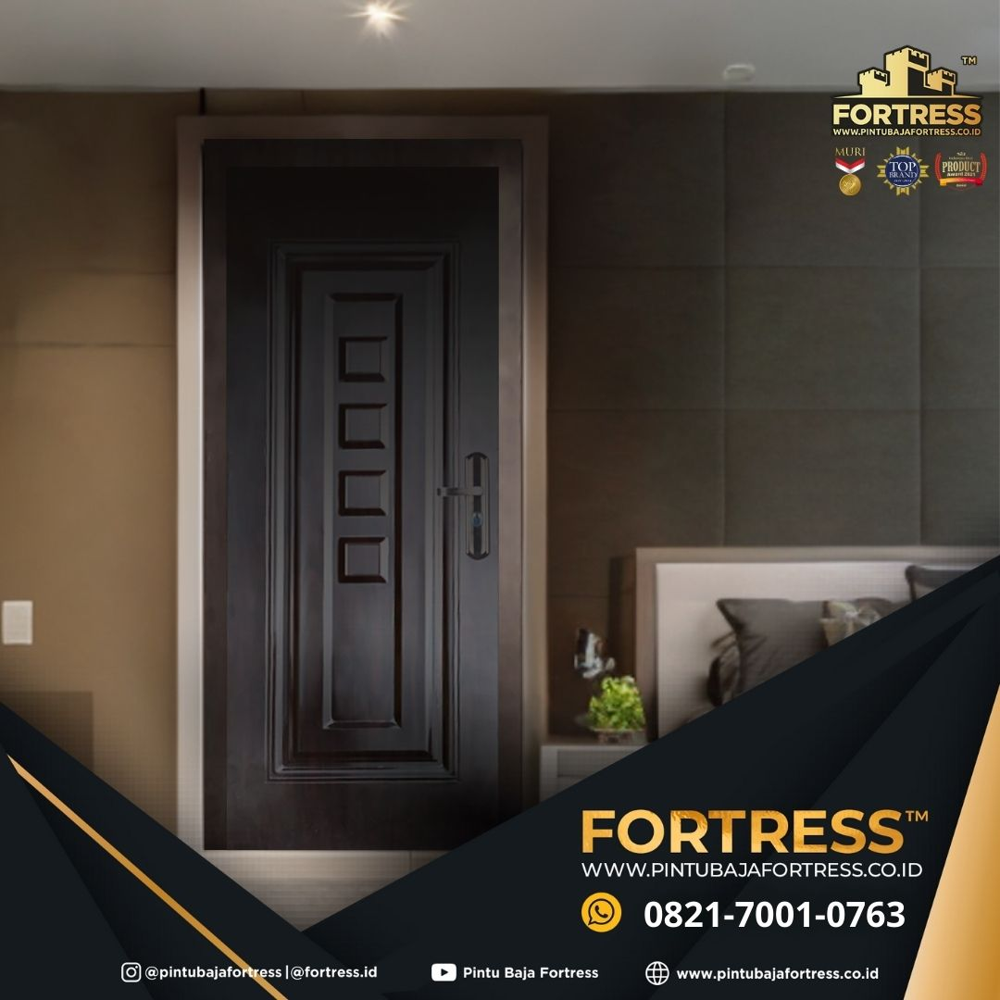

# 🚪 WA 0821 7001 0763 Pintu Baja FORTRESS Sorong
UNGGUL..!! WA 0821 7001 0763 (FORTRESS) Merk Pintu Baja Terbaik Di Biak Numfor

# 🔒 FORTRESS adalah produk Pintu Baja Motif Kayu Sebuah terobosan inovasi terbaru sebagai alternatif pengganti pintu rumah konvensional yang mengunakan material baja sebagai bahan baku utamanya.

## 🛡️ Deskripsi
UNGGUL..!! WA 0821 7001 0763 (FORTRESS) Merk Pintu Baja Terbaik Di Biak Numfor

UNGGUL..!! WA 0821 7001 0763 (FORTRESS) Merk Pintu Baja Terbaik Di Biak Numfor, Pintu Baja Anti Karat Di Intan Jaya, Pintu Baja Anti Maling Di Yahukimo, Agen Pintu Baja Fortress Di Tolikara, Agen Pintu Baja Di Boven Digoel.

FORTRESS adalah produk Pintu Baja Motif Kayu Sebuah terobosan inovasi terbaru sebagai alternatif pengganti pintu rumah konvensional yang mengunakan material baja sebagai bahan baku utamanya.

Tingkatkan Keamanan Rumah Anda dengan 13 Keunggulan Fortress Pintu Baja! 
- Material Baja Berkualitas Tinggi.
- Finishing dengan Pola Serat Kayu Alami.
- Kusen Baja dengan Detail Architrave yang Anggun.
- Engsel Baja Tersembunyi dalam 4 Set.
- Sistem Penguncian 5 Titik dengan Kunci Utama.
- Sistem Keamanan A-B Lock dengan 7 Kunci Elektronik.
- Dilengkapi dengan Slot/Grendel untuk Penguncian Tambahan.
- Terdapat Lubang Pengintip.
- Pelindung Karet pada Kusen dan Daun Pintu.
- Lapisan Honeycomb Paper sebagai Penyerap Suara.
- Lapisan PE-Film untuk Perlindungan Tambahan.
- Dilengkapi dengan 6 Set Baut Pemasangan.
- Memiliki Ambang Pintu yang Kokoh.

Dapatkan keamanan yang tak tertandingi dengan Fortress Pintu Baja, solusi pintu yang kuat dan tahan lama untuk melindungi rumah Anda.

Hubungi Kami Segera (0821-7001-0763)

Head Office (Kantor Pusat) :
Jl. Raya Binong Jl. Kp. Cijengir No. 99, Rt.005/Rw.003, Binong, Kec. Curug, Kabupaten Tangerang, Banten 15810

Kantor Cabang JBS : (Solo, Pekanbaru, Surabaya, Lampung, Palembang, Kendari, Makassar, Balikpapan, Medan, Bali, Bandung, Manado, Pontianak, Palu, Banjarmasin, Sorong, Dan Kota Lainnya Menyusul)

Provinsi Papua Tengah Meliputi : Kabupaten Nabire, Kabupaten Dogiyai, Kabupaten Deiyai, Kabupaten Paniai, Kabupaten Intan Jaya, Kabupaten Mimika, Kabupaten Puncak, Kabupaten Puncak Jaya, dan Seluruh Se-Indonesia.

#merkpintubajaterbaikdibiaknumfor #pintubajaantikaratdiintanjaya #pintubajaantimalingdiyahukimo #agenpintubajafortressditolikara #agenpintubajadibovendigoel

Merk Pintu Baja Terbaik Di Biak Numfor, Pintu Baja Anti Maling Di Mimika, Agen Pintu Baja Fortress Di Pegunungan Bintang, Agen Pintu Baja Di Yalimo, Pintu Baja Besi Di Manokwari.

---

## Pintu Baja Fortress

---

## 📞 Hubungi Kami
Klik tombol di bawah untuk langsung terhubung via WhatsApp:

## 🔍 Tags
merkpintubajaterbaikdibiaknumfor, pintubajaantikaratdiintanjaya, pintubajaantimalingdiyahukimo, agenpintubajafortressditolikara, agenpintubajadibovendigoel

